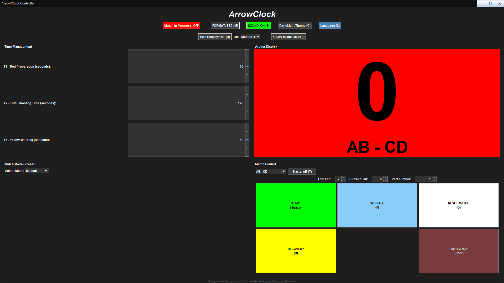
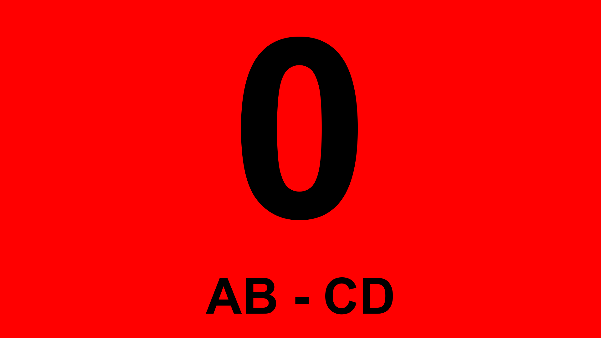

<div align="center">


# ArrowClock

### Professional Timing & Signalling Software for Archery Competitions

[](https://adoptium.net/)
[]()

</div>

---

## ✏️ About this project

I designed this software with the intention of using it on the competition field as the Director of Shooting.
It aims to be an efficient, precise, and intuitive solution that allows for a more modern and faster management of archery competitions.
The design was conceived to make the screen as simple as possible for the archer to see, thus avoiding any type of distraction.
The DOS's Controller follows the same philosophy, presenting all the available controls on the screen and making competition management as intuitive as possible.

---

## 🎯 What is ArrowClock?

**ArrowClock** is a Java Swing application designed for the **Director of Shooting** at archery competitions. It replaces traffic-light hardware with a software solution that can drive one or more external monitors simultaneously, managing the complete shooting cycle with audio whistles, automatic colour signalling, and a detailed match log.

It supports:
- **Linear shooting** (INDOOR / OUTDOOR / Manual) with turn rotation (AB–CD, A–B–C, etc.)
- **Head-to-head match** mode (Individual / Teams / Mix-Team) with chess-clock timing
- **Shoot-off** format
- **Emergency freeze** with time adjustment dialog
- **Equipment recovery** phase with booking and +40s increments
- **Bilingual UI** (English / Italian, switchable at runtime)
- **Automatic log file** recording every session event

---

## 🖥️ Screenshots

Operator View
 
Archer View
 

---

## ⚙️ Requirements

| Requirement | Minimum |
|---|---|
| Java | JRE / JDK 17 or later |
| OS | Windows 10/11 · macOS 10.14+ · Linux (Ubuntu 20.04+) |
| RAM | 2 GB |
| Display | 1 primary monitor (1024×768 minimum) |
| Audio | Any audio output for whistle sounds |

> **Don't have Java?**
> Download it for free from [https://adoptium.net/](https://adoptium.net/) or from [https://www.oracle.com/java/technologies/downloads/](https://www.oracle.com/java/technologies/downloads/).

---

## ⌨️ Key Shortcuts

| Key | Action |
|---|---|
| `Space` | Start end / Skip phase |
| `Enter` | Emergency / Resume |
| `G` | Reset match |
| `R` | Recovery / +40s / Book |
| `F` | Manual whistle |
| `T` | Rotate starting turn |
| `M` | Cycle time format (sec / mm:ss / invisible) |
| `S` | Toggle sound |
| `C` | Toggle dark / light theme |
| `L` | Switch language (EN ↔ IT) |
| `Shift` | Adjust time (during emergency only) |

---

## 📁 Log Files

When **Match in Progress** is active, ArrowClock automatically records every session event to:

```
~/ArrowClock_Logs/ArrowClock_Log.txt
```

The log is always **appended** — never overwritten — so historical sessions are preserved.

---

## 📐 Architecture

ArrowClock uses the **Command Pattern** as its core design principle. Every user action and timer event is a self-contained `Comando` class. The main class (`ArcherySoftwareMain`) acts as a pure state container with no business logic. Key supporting engines:

- `MotoreTimer` — High-precision 100ms tick with per-side fractional second accumulators
- `MotoreAudio` — Square-wave whistle generator with immediate cancellation
- `MotoreFontDinamico` — DPI-aware responsive font calculator
- `GestoreLingua` — Static localisation registry (EN / IT)

For the full technical breakdown, see [`ArrowClock_TechnicalDocs.md`](ArrowClock_TechnicalDocs.md).

---

## 📄 Documentation

| Document                                                  | Description |
|-----------------------------------------------------------|---|
| [`ArrowClock_UserManual.pdf`](ArrowClock_UserManual.pdf)  | Full bilingual user manual (EN + IT) — hardware requirements, Java installation, step-by-step usage guide, log file reference |
| [`ArrowClock_TechnicalDocs.md`](ArrowClock_TechnicalDocs.md) | Bilingual technical documentation — class inventory, design patterns, state machine, known issues |

---

## 👤 Author

**Giovanni Zucchi**
Arcieri Aquila Bianca — Modena, Italy


-Some components of this project were generated with the assistance of Google Gemini and Anthropic Claude-
