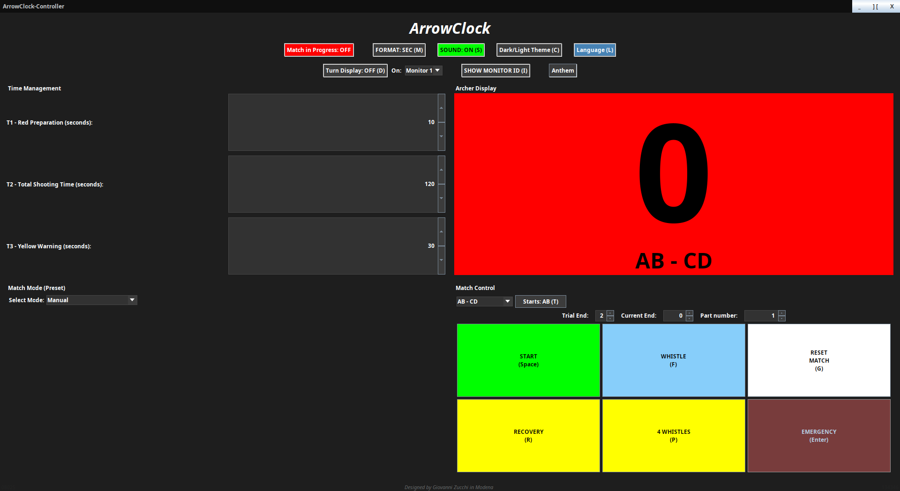
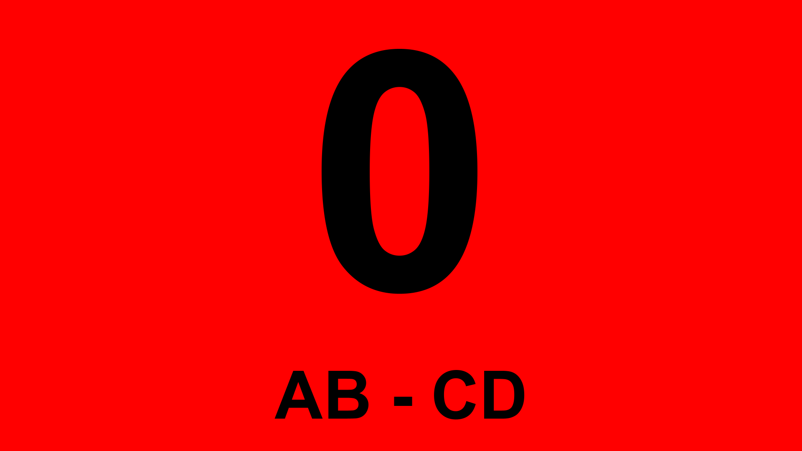

<div align="center">


# ArrowClock

### Professional Timing & Signalling Software for Archery Competitions

[](https://adoptium.net/)
[]()

</div>

---

## ✏️ About this project

I designed this software with the intention of using it on the competition field as the Director of Shooting.
It aims to be an efficient, precise, and intuitive solution that allows for a more modern and faster management of archery competitions.
The design was conceived to make the screen as simple as possible for the archer to see, thus avoiding any type of distraction.
The DOS's Controller follows the same philosophy, presenting all the available controls on the screen and making competition management as intuitive as possible.

---

## 🎯 What is ArrowClock?

**ArrowClock** is a Java Swing application designed for the **Director of Shooting** at archery competitions. It replaces traffic-light hardware with a software solution that can drive one or more external monitors simultaneously, managing the complete shooting cycle with audio whistles, automatic colour signalling, and a detailed match log.

It supports:
- **Linear shooting** (INDOOR / OUTDOOR / Manual) with turn rotation (AB–CD, A–B–C, etc.)
- **Head-to-head match** mode (Individual / Teams / Mix-Team) with chess-clock timing
- **Shoot-off** format
- **Emergency freeze** with time adjustment dialog
- **Equipment recovery** phase with booking and +40s increments
- **National Anthem mode** with automatic flag display and portable `.wav` audio playback
- **Bilingual UI** (English / Italian, switchable at runtime)
- **Automatic log file** recording every session event, bracketed by software open/close times, with an end-of-session **match summary** (statistics counted only while *Match in Progress* is ON)

---

## 🖥️ Screenshots

Operator View
 
Archer View
 

---

## ⚙️ Requirements

| Requirement | Minimum                                                                                                              |
|---|----------------------------------------------------------------------------------------------------------------------|
| Java | JRE / JDK 17 or later                                                                                                |
| OS | Windows 10/11 · macOS 10.14+ · Linux (Ubuntu 20.04+)                                                                 |
| RAM | 2 GB                                                                                                                 |
| Display | Primary monitor (1024×768 min) + Secondary display(s) 27" Full-HD (Recommended to have around 25cm of number height) |
| Audio | Any audio output for whistle sounds                                                                                  |

> **Don't have Java?**
> Download it for free from [https://adoptium.net/](https://adoptium.net/) or from [https://www.oracle.com/java/technologies/downloads/](https://www.oracle.com/java/technologies/downloads/).

---

## 🚀 Quick Start (For Non-Programmers)

If you just want to run the software and are not a developer, follow these simple steps:

1. **Download the project**:
   - Click the green **"<> Code"** button at the top of this GitHub page.
   - Select **"Download ZIP"**.
   - Once downloaded, extract the ZIP folder to your Desktop or preferred location.

2. **Run the Application**:
   - Open the extracted folder and navigate to the `Jar_File` directory.
   - You will find a file named `ArrowClock.jar`.
   - **Windows / macOS**: Simply **double-click** the `ArrowClock.jar` file to launch the application. *(If it doesn't open, make sure you have installed Java as mentioned in the Requirements).*

> **P.S. for Linux Users 🐧**: To ensure smooth graphics and avoid visual issues, it is highly recommended to run the application from the terminal with hardware acceleration enabled. Open your terminal in the `Jar_File` folder and type:
> ```bash
> java -Dsun.java2d.opengl=true -jar ArrowClock.jar
> ```

---

## ⌨️ Key Shortcuts

| Key | Action |
|---|---|
| `Space` | Start end / Skip phase |
| `Enter` | Emergency / Resume |
| `G` | Reset match |
| `R` | Recovery / +40s / Book |
| `F` | Manual whistle |
| `T` | Rotate starting turn |
| `M` | Cycle time format (sec / mm:ss / invisible) |
| `S` | Toggle sound |
| `C` | Toggle dark / light theme |
| `L` | Switch language (EN ↔ IT) |
| `Shift` | Adjust time (during emergency only) |

---

## 📁 Log Files & Media (Portable Mode)

ArrowClock is designed to be **100% portable**. It does not require installation.
On launch it writes a **software-start line** (so the log folder exists from the very first run), and while **Match in Progress** is active it records every session event in detail. When you close the app, it appends a **match summary** — actual match time, parts, ends, emergencies and recoveries — counting **only** the periods when *Match in Progress* was ON. The log folder is created in the exact same directory as the `.jar` executable:

```text
📁 Your_ArrowClock_Folder/
 ├── ☕ ArrowClock.jar
 ├── 📁 ArrowClock_Logs/       (Created automatically)
 │    └── 📄 ArrowClock_Log.txt
 └── 📁 ArrowClock_Media/      (Create this to use the Anthem feature)
      ├── 🎵 anthem.wav
      └── 🖼️ flag.png
```

The log is always **appended** — never overwritten — so historical sessions are preserved.

---

## 📐 Architecture

ArrowClock uses the **Command Pattern** as its core design principle. Every user action and timer event is a self-contained `Comando` class. The main class (`ArcherySoftwareMain`) acts as a pure state container with no business logic. Key supporting engines:

- `MotoreTimer` — High-precision 100ms tick with per-side fractional second accumulators
- `MotoreAudio` — Square-wave whistle generator with immediate cancellation
- `MotoreFontDinamico` — DPI-aware responsive font calculator
- `GestoreLingua` — Static localisation registry (EN / IT)

For the full technical breakdown, see [`ArrowClock_TechnicalDocs.md`](ArrowClock_TechnicalDocs.md).

---

## 🧪 Testing (for developers)

ArrowClock ships with an **automated test suite** that locks in the competition-critical logic — phase transitions and exact whistle counts — so a future change can't silently break a live competition. The tests use a **zero-dependency runner** (plain Java, no JUnit, no build tool), matching the project's portable philosophy. They live in `Tests/` and are **not** part of the distributed `.jar` (built from `Codes/` only).

Run them from the project root:

```bash
./run_tests.sh      # Linux / macOS
run_tests.bat       # Windows
```

The scripts compile to a temporary folder and run everything; they exit `0` if all tests pass. See Section 11 of the technical documentation for details.

---

## 📄 Documentation

| Document                                                  | Description |
|-----------------------------------------------------------|---|
| [`ArrowClock_UserManual.pdf`](ArrowClock_UserManual.pdf)  | Full bilingual user manual (EN + IT) — hardware requirements, Java installation, step-by-step usage guide, log file reference |
| [`ArrowClock_TechnicalDocs.md`](ArrowClock_TechnicalDocs.md) | Bilingual technical documentation — class inventory, design patterns, state machine, known issues |

---

## 📬 Get in Touch / Support

If you successfully use ArrowClock in an official competition or training session, I would absolutely love to see it in action! Feel free to send photos of your control unit and the displays on the field to **gvnnsecondo@gmail.com**.

You can also use this email address for any clarifications, questions, or support requests regarding the software.

⭐ **Did ArrowClock work perfectly for you? Please consider giving this project a Star on GitHub!**

---

## 👤 Author

**Giovanni Zucchi**
Arcieri Aquila Bianca — Modena, Italy


-Some components of this project were generated with the assistance of Google Gemini and Anthropic Claude-
